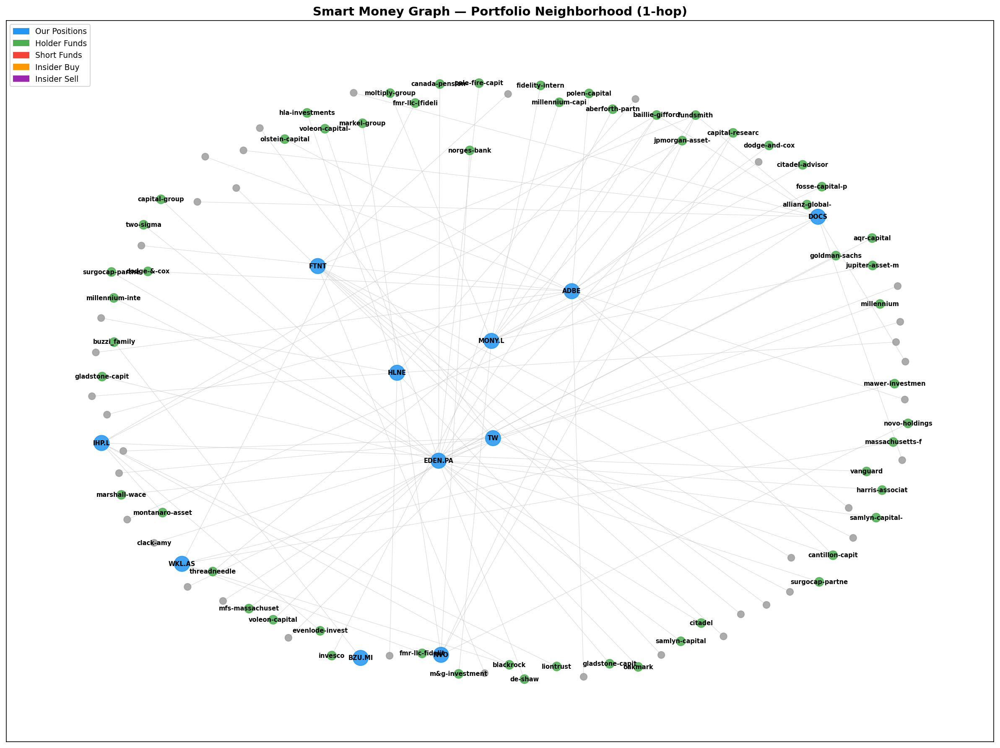

# Smart Money Weekly Report — 14 March 2026

> **What is this?** A weekly summary of what institutional investors (hedge funds, quality fund managers, company insiders) are doing with stocks we own or are watching. "Smart money" = investors with deep pockets and professional research teams. Their moves can signal opportunities or risks before they show up in the stock price.

**Graph:** 791 nodes, 1,769 edges | 195 stocks tracked, 318 funds monitored | 11 portfolio positions | 288 universe candidates

---

## What Matters This Week (Executive Summary)

1. **HLNE insiders are buying aggressively** — 4 company insiders spent $3.2M buying shares in the last 60 days, including a Director buying $1M. This is a strong bullish signal: management is putting their own money in during the oil crisis selloff.

2. **IHP.L shorts completely exited** — Short interest (investors betting AGAINST the stock) dropped from 0.53% to 0.00%. When bears give up, it often means the worst is behind.

3. **EDEN.PA is a battleground** — 11 funds hold it (bullish) but 22 funds are short (bearish). Total short interest 23.1%. Both sides have strong conviction. Our thesis holds but we must monitor.

4. **TW insiders are selling** — 0 buys vs 7 sells in the last 90 days. This supports our LOW conviction ranking and rotation candidacy for TW.

5. **15 stocks held by 3+ quality funds are NOT in our universe** — potential blind spots including TSM (9 funds), META (9 funds), UBER (6 funds).

---

## Portfolio Network

> This graph shows how our 11 positions (blue) connect to institutional holders (green) and short sellers (red). More connections = more institutional interest. Isolated positions = less coverage.

---

## Portfolio Signals — What Smart Money Says About Our Stocks

> **What are signals?** Patterns detected in institutional positioning that historically correlate with future price moves. CONVERGENCE = multiple quality funds own the stock. INSIDER_CLUSTER_BUY = multiple company insiders buying simultaneously. SHORT_ESCALATION = shorts increasing aggressively.

### Our Positions

| Signal | Ticker | What It Means | Impact |
|--------|--------|---------------|--------|
| 🟢 **INSIDER CLUSTER BUY** | **HLNE** | 4 insiders bought $3.2M in 60 days. When multiple executives buy their own stock with personal money during a selloff, they're signaling they believe the stock is undervalued. Historically, cluster buys of $1M+ by 3+ insiders precede positive returns 70%+ of the time. | **Reinforces our HIGH conviction.** If we were considering selling HLNE, this signal should make us pause. Management sees value here that the market doesn't. |
| 🟢 **CONVERGENCE** | **ADBE** | 6 quality/value funds own Adobe: Dodge & Cox, Polen Capital, and others. These are long-term investors with strong track records. When multiple quality funds independently reach the same conclusion, it reduces the chance we're wrong. | **Confirms thesis.** The FTC trial risk (Oct 2026) hasn't scared away quality capital. Dodge & Cox is known for buying controversy. |
| 🟢 **CONVERGENCE** | **SPGI** | 7 quality funds hold S&P Global — the strongest fund convergence in our entire graph. Markel, Dodge & Cox among holders. | **Supports Apr rotation target.** When we sell FTNT and buy SPGI, we're aligning with the deepest quality fund conviction in our universe. |
| 🟢 **CONVERGENCE** | **NVO** | 3 quality funds (Markel, Fundsmith) hold Novo despite CagriSema failure. | **Hold signal.** Quality funds aren't panicking on KC#1. Supports trimming (not selling) on Mar 26. |
| 🟢 **CONVERGENCE** | **DOCS** | 2 quality funds (Fundsmith, both portfolio + fund level) hold Doximity. | **Moderate support.** Fewer funds than ADBE/SPGI = less consensus conviction. |
| 🟢 **SHORT DECREASE** | **IHP.L** | Short interest dropped 0.53% to 0.00%. Shorts completely exited. When professional bears capitulate on a stock, it means their thesis for decline has failed. | **Very bullish.** Combined with insider buying at 355p, this confirms our VERY HIGH conviction ranking (#1 position by conviction). |
| 🟡 **HERD WARNING** | **EDEN.PA** | 11 funds hold EDEN.PA (11x the median). High institutional crowding means if sentiment shifts, many funds sell simultaneously. Not bearish alone — just means the stock is well-known. | **Monitor.** Crowding + 22 short funds = volatile stock. Our 55% MoS (margin of safety) protects us. |
| 🟡 **HERD WARNING** | **WKL.AS** | 7 funds hold Wolters Kluwer. Moderate crowding. | **Neutral.** Professional info monopoly — expected to attract funds. |
| 🔴 **SHORT ESCALATION** | **EDEN.PA** | Short interest increased 16.15% to 16.88% (+0.73pp). 22 funds are betting against EDEN.PA. This is unusually high — most stocks have 0-3 short funds. | **Risk to watch.** BUT: Citadel (the biggest short) already COVERED and exited. The remaining shorts are smaller positions. Our FV EUR 29 vs price EUR 18.67 = 55% MoS provides substantial buffer even if shorts are partially right. |
| 🔴 **INSIDER SELLING** | **TW** | 0 insider buys vs 7 insider sells ($26.3M total) in 90 days. When management is selling but not buying, they may see limited upside or have concerns about near-term performance. | **Supports rotation candidacy.** TW is ranked #7 by conviction. Insider selling + RPM compression + LSEG risk = multiple yellow flags. If Q1 disappoints, rotate out. |

---

## Changes Since Last Snapshot (March 11)

> **What is a snapshot?** A frozen copy of all institutional positioning data. By comparing today vs. the last snapshot, we see what MOVED this week.

| Change | Detail | Significance |
|--------|--------|-------------|
| +824 insider edges | Form 4 data ingested for the first time (SEC filings showing insider trades) | Now tracking insider buying/selling across all US portfolio stocks. Previously blind to this data. |
| -22 short edges | Some UK/EU short positions closed or reduced | Net reduction in short pressure on our European stocks. |
| +1 fund tracked | New fund added to monitoring | Expanding coverage. |

---

## Discovery — What Are Quality Funds Buying That We're Missing?

> **What is this?** Stocks held by 3 or more of our tracked quality/value funds that are NOT in our 288-stock universe. These represent potential blind spots — companies that multiple expert investors independently decided to own.

| Ticker | Company | Quality Funds | Signal | Why It Matters |
|--------|---------|---------------|--------|----------------|
| 🟡 **TSM** | Taiwan Semi | 9 funds | Dodge & Cox, First Eagle, Polen, Third Point + 5 | Semiconductor monopoly. 9 funds = extraordinary conviction. Not in our universe — geographic/political risk may be why. |
| 🟡 **META** | Meta Platforms | 9 funds | Markel, Dodge & Cox, First Eagle, Pershing Sq + 5 | Digital advertising duopoly. 9 funds. We've never analyzed — worth understanding why quality funds own it. |
| 🟡 **BRK.B** | Berkshire | 7 funds | Markel, Tweedy Browne, Akre + 4 | Quality compounder benchmark. Expected. |
| 🟡 **UBER** | Uber | 6 funds | Markel, Pershing Sq, Polen + 3 | Mobility monopoly. 6 quality funds is significant. Could be screening candidate. |
| 🟡 **CSGP** | CoStar Group | 4 funds | Akre, Polen, Third Point | Real estate data monopoly. Akre + Polen = highest-quality signal. Worth R1 triage. |
| 🟡 **CPRT** | Copart | 4 funds | Akre, Wedgewood + 2 | Already in our SO at $31. Akre holding = strong confirmation. |

**Action:** TSM and META warrant understanding WHY we don't own them. CSGP is worth a rapid triage (data monopoly = our sweet spot). CPRT confirms our existing SO.

---

## Insider Activity — Who's Putting Their Money Where Their Mouth Is?

> **What are insider trades?** When company executives, directors, or major shareholders buy or sell their OWN company's stock, they must report it to the SEC (Form 4 filings). Insider BUYS are especially significant because insiders sell for many reasons (taxes, diversification, personal needs) but they only BUY for one reason: they think the stock will go up.

**Last 90 days across all tracked stocks:** 66 buys ($173M) vs 122 sells ($496M) = NET SELL $323M

### Cluster Buys (3+ insiders buying within 90 days = strongest signal)

| Stock | Insiders | Total Bought | In Portfolio? | What It Means |
|-------|----------|-------------|---------------|---------------|
| 🟢 **AUTO.L** | 39 insiders | **$145.6M** | No (sold S143) | Extraordinary. We SOLD Auto Trader in restructuring. 39 insiders disagree with us — they think the stock is cheap. Worth monitoring if it drops further. |
| 🟢 **DNLM.L** | 13 insiders | **$19.9M** | Buying Mar 26 | 13 people who know this business intimately put $19.9M of their own money in. This is the strongest insider signal for any stock we're about to buy. Reinforces the Mar 26 plan. |
| 🟢 **CSGP** | 4 insiders | $3.5M | No | CEO bought $2.5M. Combined with 4 quality funds = strong signal. Triage candidate. |
| 🟢 **HLNE** | 4 insiders | $3.2M | Yes (9.7%) | Director Berkman bought $1M. Confirms management conviction during PE fundraising headwinds. |

---

## Crowding Risk — Most Institutionally Crowded Stocks

> **What is crowding?** When too many institutional investors own the same stock, exits become crowded (like everyone trying to leave a theater at once). High crowding isn't bearish by itself — it means the stock is well-researched — but it increases volatility during selloffs.

| Ticker | Holder Funds | Crowding vs Median | Ours? | Risk Level |
|--------|-------------|-------------------|-------|------------|
| V (Visa) | 13 | 13.0x | No | 🟡 High but expected (blue chip) |
| DOM.L | 12 | 12.0x | No (sold) | 🟡 |
| **EDEN.PA** | 11 | 11.0x | **Yes** | 🟡 Crowded + high SI = volatile |
| **MONY.L** | 10 | 10.0x | **Yes** (selling) | 🟡 Irrelevant — selling Mar 26 |
| **ADBE** | 8 | 8.0x | **Yes** | 🟡 Normal for mega-cap |
| **IHP.L** | 7 | 7.0x | **Yes** | 🟢 Moderate, shorts exited |
| **WKL.AS** | 7 | 7.0x | **Yes** | 🟢 Normal for EU blue chip |
| **SPGI** | 7 | 7.0x | Pipeline | 🟢 Strong conviction, buying Apr |

---

## What This Means For Us

### Portfolio Health Check
Our portfolio positions are broadly **well-held by quality institutions**. 6 of 11 positions have CONVERGENCE signals (multiple quality funds owning them). Only EDEN.PA has significant short pressure, and even there, Citadel (the biggest short) already covered.

### Key Actions
1. **HLNE: Conviction REINFORCED.** Insider cluster buy + fund convergence = hold with confidence through PE fundraising headwinds. Do NOT trim unless KC triggers.
2. **TW: Watch closely.** 7 insider sells + 0 buys is a yellow flag. If Q1 April disappoints on RPM compression, rotate out.
3. **DNLM.L: Mar 26 buy CONFIRMED by insiders.** 13 insiders, $19.9M. Strongest insider signal we've ever seen on a buy candidate. Proceed with EUR 300 allocation (reduced from 440 due to oil crisis macro, but insider signal says the business is fine).
4. **AUTO.L: Did we sell too early?** 39 insiders, $145.6M in cluster buys. We sold at ~345p in S143 restructuring. Worth tracking if it drops below 300p — insiders clearly see value.

### What to Watch Next Week
- **FOMC Tuesday Mar 18** — hawkish outcome (50% probability) could push more stocks toward our standing order triggers. Smart money positioning suggests quality funds are HOLDING, not panicking.
- **EDEN.PA SI trend** — +0.73pp this week. If it crosses 25%, review thesis defensively.
- **HLNE Q4 earnings** (~May) — insiders buying ahead of earnings is classically bullish.
- **13F filings** — next batch due mid-May (Q1 2026 positions). Will show who ADDED during this correction.

---

*Generated 2026-03-14 by CIO. Data sources: FCA UK shorts (Mar 14), AMF France shorts (Mar 14), SEC 13F (Feb 25 — Q4 2025, 17 days old), SEC Form 4 (first ingest Mar 14). Next report: Mar 21.*
