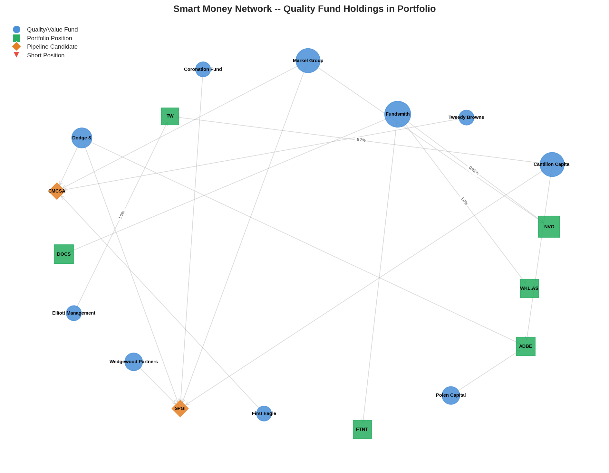

# Smart Money Daily Report — 2026-03-23

## 1. Signal Summary

| Signal | Count | Details |
|--------|-------|---------|
| CONVERGENCE (BULL) | 5 | ADBE (6 funds), NVO (3), DOCS (2), FTNT (2), TW (2) |
| FOUNDER_CONVICTION | 2 | WKL.AS CEO $426K, HLNE Director $1.01M |
| INSIDER_CLUSTER_BUY | 1 | HLNE: 4 insiders $3.24M in 60d |
| SHORT_ESCALATION | 1 | EDEN.PA: SI 23.5% (22 funds) |
| HERD_WARNING | 7 | EDEN.PA (14x), IHP.L (12x), WKL.AS (12x), MONY.L (10x), ADBE (8x), TW (7x), NVO (6x) |

## 2. Alerts (vs yesterday)

- **[NEW_HOLDER] WKL.AS: Fundsmith entered position** — Terry Smith initiated late 2025. VERY HIGH signal.
- **[NEW_HOLDER] TW: 6 new holders captured** — T. Rowe Price 13.6%, Wellington 8.1%, Vanguard 10.3%, BlackRock 5.9%, LSEG 50.8%, Elliott 1%. OSINT capture from S284.

## 3. Portfolio Position SM Profile

| Ticker | Holders | Active/Passive | Insiders | SI | Signal Quality |
|--------|---------|---------------|----------|-----|----------------|
| ADBE | 8 (Dodge&Cox, Polen, Cantillon) | Mixed | 0 buys, 77 sells (10b5-1) | 3.9% | **STALE** — all Q4 2025 pre-CEO/CMA |
| DOCS | 3 (Fundsmith, Baillie Gifford) | Active | Wampler 10b5-1 monthly sells | 8.3% | **POSITIVE** — Fundsmith adding |
| EDEN.PA | 14 (Capital Research 10%, BG 5.4%, Harris 5%) | Mixed | Board member bought $50K Mar 21 | **23.5%** | **CONTESTED** — heavy long + heavy short |
| FTNT | 2 (Fundsmith) | Active | 0 buys | 2.9% | **NEUTRAL** — thin coverage |
| HLNE | 1 (none tracked) | — | 4 cluster buys $3.24M | 8.5%↑ | **MIXED** — insiders buying but net -$19M |
| IHP.L | 12 (BG 2.21%, Evenlode 5.3%, Liontrust 5%) | Mixed | 0 data | 0.5% (Saba) | **ADEQUATE** — UK institutional base |
| MONY.L | 10 (multiple UK funds) | Mixed | 0 data | — | **SELLING Mar 26** — irrelevant |
| NVO | 6 (Markel, Fundsmith, Novo Holdings 28%) | Active | 0 data | 0.9% | **STALE** — Q4 2025 pre-guidance disaster |
| TW | 7 (T.Rowe 13.6%, Wellington 8.1%, LSEG 50.8%) | Mostly passive | 30 sells (all 10b5-1), 0 buys | 2.2%↑ | **WEAK** — passive + controlling shareholder |
| WKL.AS | 12 (Mawer 5.7%, MFS 3%, Fidelity 4.1%, Fundsmith NEW) | **80% active** | CEO+CFO bought $727K Aug 2025 | 0% | **STRONG** — best active holder profile |

## 4. Short Interest Monitor

| Ticker | SI % | Trend | Funds | Assessment |
|--------|------|-------|-------|------------|
| **EDEN.PA** | **23.5%** | Stable (was 23.5%) | 22 funds (CPPIB 2.32%, Citadel 2.10%, Millennium 1.90%) | HEAVILY SHORTED — thesis contested. Board member bought Mar 21 = contra-signal. |
| HLNE | 8.5% | Rising (+27.3% MoM) | Not detailed | RISING — soft cycle + PE sentiment |
| DOCS | 8.3% | Unknown | Not detailed | ELEVATED for micro-cap |
| ADBE | 3.9% | Rising (+15.6%) | Not detailed | MODERATE — post-CEO/CMA |
| FTNT | 2.9% | Stable | Not detailed | NORMAL |
| TW | 2.2% | Rising (+12.8% MoM) | Not detailed | LOW but trending up |
| NVO | 0.9% | Stable | Not detailed | LOW |
| IHP.L | 0.5% | Stable | 1 (Saba Capital) | MINIMAL |

## 5. Insider Activity Highlights

| Ticker | Activity | Signal |
|--------|----------|--------|
| WKL.AS | CEO Caywood $426K + CFO Entricken $301K (Aug 2025 dip) | **BULL** — bought during -26.5% drawdown |
| HLNE | 4 insiders bought $3.24M (cluster) BUT French River $22M sell | **MIXED** — net NEGATIVE $19M |
| EDEN.PA | Board member Kelly Richdale $50K (Mar 21) | **MILD BULL** — small but recent |
| All others | 10b5-1 pre-planned sells (NEUTRAL) or no data | NEUTRAL |

## 6. Crowding & Concentration Risk

| Ticker | Holders | Crowding Score | Risk |
|--------|---------|----------------|------|
| EDEN.PA | 14 | 14.0x median | **HIGH** — most crowded + most shorted = powder keg |
| IHP.L | 12 | 12.0x | MODERATE — UK institutional base, diversified |
| WKL.AS | 12 | 12.0x | LOW — 80% active quality holders, not herd |
| MONY.L | 10 | 10.0x | IRRELEVANT — selling Mar 26 |
| ADBE | 8 | 8.0x | MODERATE — but data is stale |
| TW | 7 | 7.0x | MODERATE — LSEG 50.8% dominates |

## 7. Discovery & Pipeline Intelligence

| Finding | Source | Actionability |
|---------|--------|--------------|
| **Fundsmith initiated WKL.AS** late 2025 | SM capture S284 | CONFIRMS quality thesis. Conviction upgrading candidate. |
| **Mitsui Sumitomo $3.8B + board seat WRB** | Insurance sector refresh | Strongest single SM signal in pipeline. WRB DA done today (MODERATE COUNTER). |
| **KNSL SO $355 TRIGGERED** ($328.21) | Insurance sector refresh | GATED on Q1 GWP. Jefferies downgraded. Do NOT execute without gate. |
| MEGP.L audit clean, shares resumed | News sweep | R4 committee launched. BUY SO 135p approved. |

## 8. Data Freshness

| Source | Last Update | Status |
|--------|------------|--------|
| FCA UK shorts | Fresh | FRESH |
| AMF France shorts | Fresh | FRESH |
| SEC 13F | Q4 2025 (Dec 31) | **STALE** — next update May 2026 (Q1 2026 13Fs) |
| SEC Form 4 | Fresh | FRESH |
| EU OSINT (manual) | Mar 23 (WKL.AS, TW) | FRESH |

## 9. Graph Stats

| Metric | Value |
|--------|-------|
| Total nodes | 801 (196 stocks, 324 funds, 281 persons) |
| Total edges | 1,826 |
| Edge types | insider_sell 943, holds 358, corp_buyback 231, shorts 199, insider_buy 93 |
| Coverage | 17 fully covered (100%), 147 partial, 32 no data |
| Portfolio coverage | 100% target — all 11 positions have SM data |
| Snapshots saved | 13 total |

## 10. Action Items

1. **EDEN.PA**: SI 23.5% + 14 holders = most contested position. Board member buying is contra-signal. Monitor for AMF short position changes this week.
2. **NVO SM is STALE**: All fund data is pre-guidance disaster (Q4 2025 13F). Fundsmith and Markel may have exited post-Feb. No way to know until Q1 13Fs (~May).
3. **ADBE SM is STALE**: Same issue — all pre-CEO departure and CMA. 6 funds may not reflect current conviction.
4. **WKL.AS**: Strongest active SM profile in portfolio. Fundsmith NEW + CEO/CFO bought dip. Conviction upgrade candidate.
5. **TW OSINT captured**: Profile went from 1→7 holders. Mostly passive (T.Rowe, Vanguard, BlackRock). LSEG 50.8% dominates. EXIT CONDITIONAL still correct.

---

## Charts

