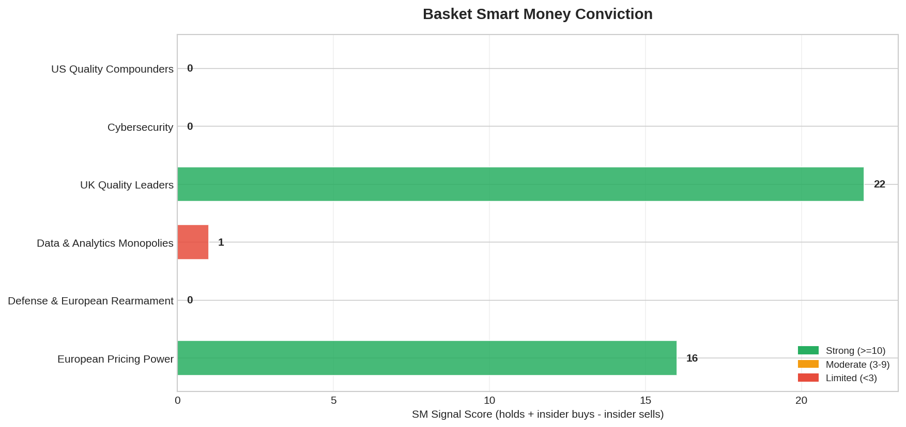
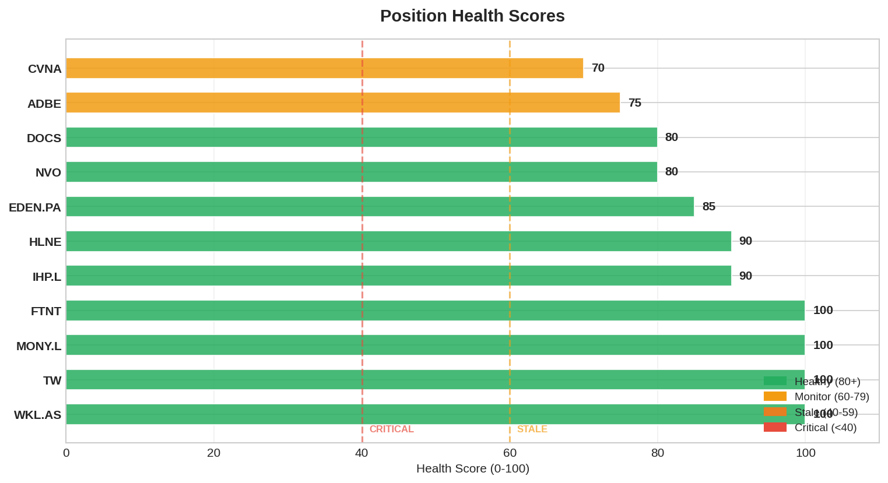

# Smart Money Daily Report — 2026-03-24

> D-1 before Mar 26 execution (7 trades). Pre-execution SM snapshot.

## 1. Signal Summary

| Signal | Count | Details |
|--------|-------|---------|
| CONVERGENCE (BULL) | 5 | ADBE (6 funds), NVO (3), DOCS (2), FTNT (2), TW (2) |
| FOUNDER_CONVICTION | 2 | WKL.AS CEO $426K, HLNE Director $1.01M |
| INSIDER_CLUSTER_BUY | 1 | HLNE: 4 insiders $3.24M in 60d |
| SHORT_ESCALATION | 1 | EDEN.PA: SI 23.5% (22 funds) |
| HERD_WARNING | 9 | DOCS (16x), EDEN.PA (14x), IHP.L (12x), WKL.AS (12x), MONY.L (10x), ADBE (8x), TW (7x), NVO (6x), FTNT (5x) |

**Change vs yesterday:** DOCS HERD_WARNING escalated from 3x to 16x (OSINT capture effect). FTNT now triggers HERD_WARNING (5x, newly captured holders).

## 2. Alerts (vs 2026-03-23 snapshot)

**All alerts are from yesterday's OSINT capture settling into graph comparison:**
- DOCS: 10 new holders (Vanguard, FMR, BlackRock, William Blair, Capital World, ClearBridge, Franklin, Geode, T.Rowe, William Blair)
- FTNT: 3 new holders (BlackRock, Vanguard, Ken Xie founder)

No organic changes detected — these are capture artifacts, not real-time fund movements.

## 3. Portfolio SM Profile — Pre-Execution Snapshot

### Positions SELLING Mar 26:

| Ticker | Holders | Key Signal | Selling Rationale |
|--------|---------|-----------|-------------------|
| MONY.L | 10 | HERD (10x) | Growth 2% lowest, rotation |
| FTNT | 5 | Fundsmith holds, Ken Xie 7% | E[CAGR] 10.6% worst, EXIT approved |
| NVO (trim) | 6 | Markel + Fundsmith | KC#1 triggered, trim 11.7%→7% |

**SM does NOT block any sell.** MONY.L/FTNT SM is adequate but E[CAGR] drives the exit. NVO Fundsmith+Markel is Q4 2025 data (stale post-guidance disaster).

### Positions BUYING Mar 26:

| Ticker | SM Data | Signal Quality | Notes |
|--------|---------|---------------|-------|
| GDDY | Thin (OSINT not done) | LOW | Securities investigation noise. Need SM capture post-buy. |
| DNLM.L | Thin (33% coverage) | LOW | UK mid-cap below radar. 38.5% insider = alignment. |
| ITRK.L | Thin (33% coverage) | LOW | 4 directors bought cluster Mar 13-16 = POSITIVE |
| MEGP.L | Zero tracked holders | NONE | UK micro-cap. 36.5% founder = alignment via ownership. |

**SM is thin for all 4 buys.** This is expected — these are UK/US mid-caps below institutional radar. The thesis for each rests on fundamentals, not SM convergence. Post-execution EU OSINT capture priority for DNLM.L and ITRK.L.

### Positions HOLDING:

| Ticker | Holders | Active% | Key Signal | Quality |
|--------|---------|---------|-----------|---------|
| WKL.AS | 12 | 80% active | Fundsmith NEW + CEO/CFO bought dip | **STRONGEST** |
| ADBE | 8 | Mixed | 6 funds but ALL stale Q4 2025 pre-events | **STALE** |
| DOCS | 16 | Mixed | Fundsmith core + FMR/Capital World adding aggressively | **STRONG** |
| EDEN.PA | 14 | Mixed | 23.5% SI + 14 holders = most contested | **CONTESTED** |
| IHP.L | 12 | Mixed | BG 2.21% + Evenlode 5.3% + Liontrust 5% | **ADEQUATE** |
| HLNE | 1 | — | 4 insider cluster buy $3.24M BUT net -$19M | **MIXED** |
| TW | 7 | Mostly passive | T.Rowe 13.6%, LSEG 50.8% controlling | **WEAK** |
| CVNA | 0 | — | Short position, no SM data | N/A |

## 4. Short Interest Monitor

| Ticker | SI % | Trend | Assessment |
|--------|------|-------|------------|
| **EDEN.PA** | **23.5%** | Stable | HEAVILY SHORTED — thesis contested |
| HLNE | 8.5% | Rising | Soft cycle + PE sentiment |
| DOCS | 8.3% | Stable | Elevated for small-cap |
| ADBE | 3.9% | Rising | Post-CEO/CMA |
| FTNT | 2.9% | Stable | Selling tomorrow |
| TW | 2.2% | Rising | LSEG overhang |
| NVO | 0.9% | Stable | Low |
| IHP.L | 0.5% | Stable | Minimal (Saba only) |

## 5. Insider Activity

| Ticker | Activity | Signal |
|--------|----------|--------|
| WKL.AS | CEO $426K + CFO $301K bought Aug 2025 | **BULL** |
| HLNE | 4 cluster buys $3.24M, French River -$22M | **MIXED** (net negative) |
| ITRK.L | 4 directors bought cluster Mar 13-16 | **BULL** (buying entry) |
| EDEN.PA | Board member $50K Mar 21 | **MILD BULL** |
| MEGP.L | Crasnianski 36.5% (founder, not traded) | **ALIGNED** |
| All others | 10b5-1 sells (NEUTRAL) or no data | NEUTRAL |

## 6. Crowding Risk

| Ticker | Holders | Crowding | Risk |
|--------|---------|----------|------|
| DOCS | 16 | 16.0x | HIGH (inflated by OSINT capture — monitor for real accumulation) |
| EDEN.PA | 14 | 14.0x | **HIGHEST REAL** — 14 holders + 23.5% SI |
| IHP.L | 12 | 12.0x | MODERATE |
| WKL.AS | 12 | 12.0x | LOW (80% active quality) |
| MONY.L | 10 | 10.0x | SELLING tomorrow |

## 7. Pre-Execution SM Assessment

**No SM signal blocks any of the 7 trades tomorrow.**

Sells (MONY.L, FTNT, NVO trim): SM is adequate but irrelevant — decisions driven by E[CAGR] ranking and KCs.

Buys (GDDY, DNLM.L, ITRK.L, MEGP.L): SM coverage is thin for all 4 — expected for mid-caps. Thesis quality is the driver, not SM convergence. ITRK.L has the best insider signal (4 director buys). MEGP.L has founder alignment (36.5%).

**Post-execution priority:** EU OSINT capture for DNLM.L and ITRK.L (both UK, need holder + insider data).

## 8. Discovery & Pipeline

| Finding | Source | Actionability |
|---------|--------|--------------|
| KNSL SO $355 TRIGGERED ($328) | Insurance refresh | GATED on Q1 GWP. Do NOT execute. |
| ALFA.L SO 165p TRIGGERED (151p) | Pipeline scan | **BUYING Mar 27** |
| MEGP.L SO 135p TRIGGERED (133.8p) | Price check | **BUYING Mar 26** |
| MELI R3 complete, entry $1,500 | S284 resolution | 10% from current. Monitor. |

## 9. Graph Stats

| Metric | Today | Yesterday | Delta |
|--------|-------|-----------|-------|
| Nodes | 809 | 801 | +8 |
| Edges | 1,842 | 1,826 | +16 |
| Stocks | 196 | 196 | 0 |
| Funds | 332 | 324 | +8 |
| Snapshots | 14 | 13 | +1 |

All sources FRESH.

## 10. Action Items

1. **Mar 26 AM:** Execute 7 trades per plan v3
2. **Mar 27:** Execute ALFA.L EUR 400
3. **Post-execution:** OSINT capture for DNLM.L + ITRK.L (UK holders, insiders)
4. **Post-execution:** GDDY SM capture (currently thin)
5. **Monitor:** EDEN.PA SI 23.5% — any AMF updates this week
6. **Monitor:** NVO + ADBE SM staleness — Q1 13Fs due ~May

---

## Charts

