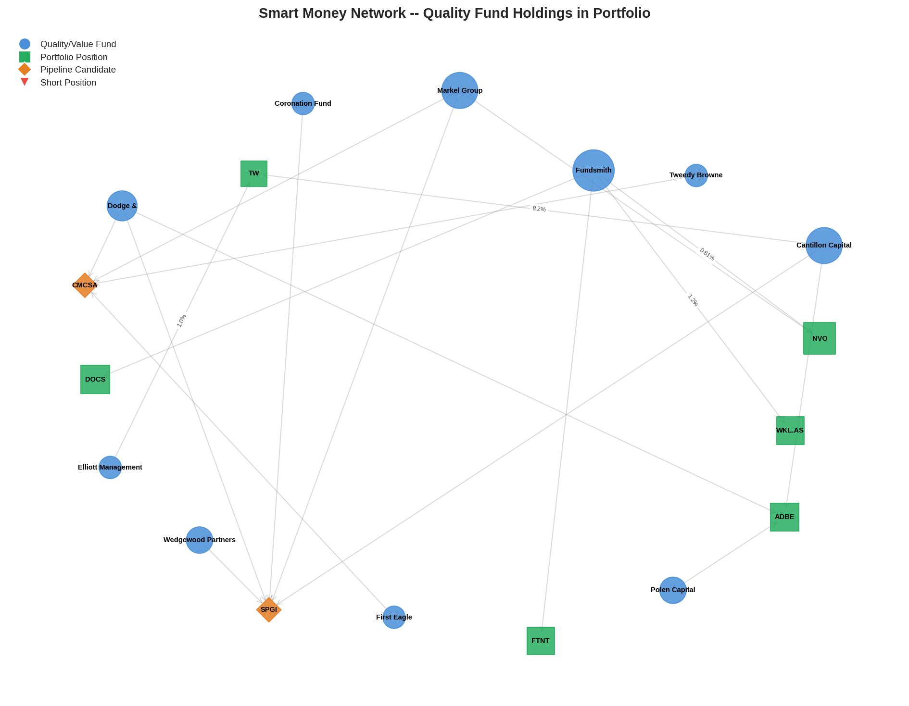
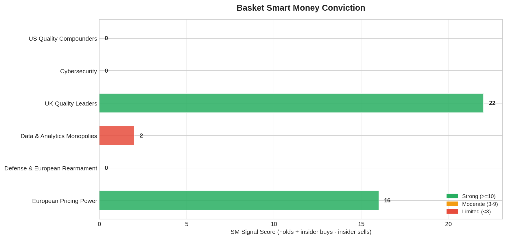
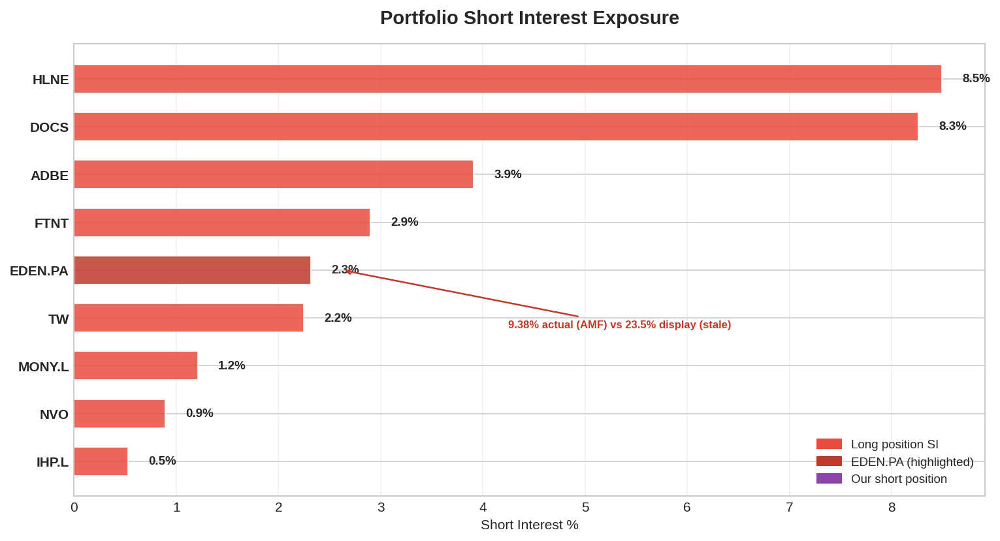
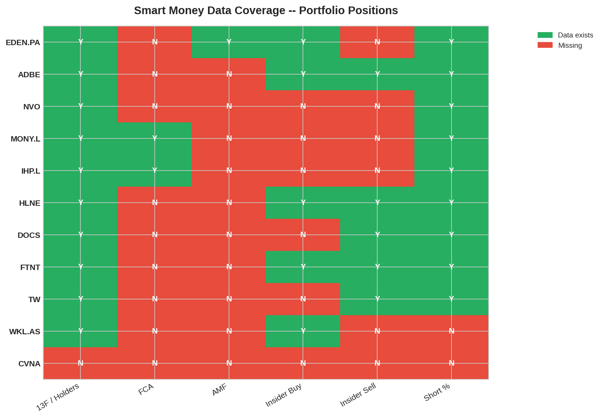
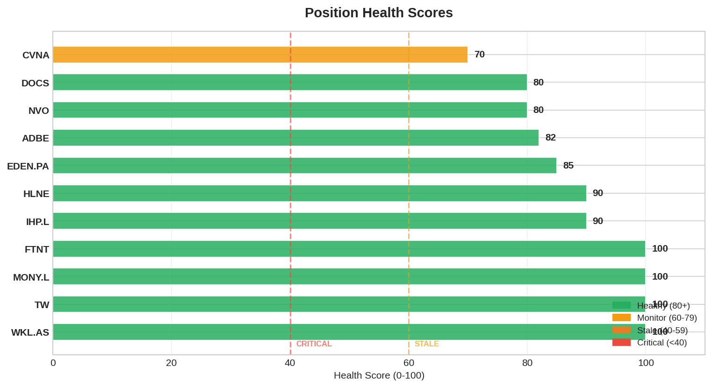

# Smart Money Daily Report — 2026-03-25

> **D-DAY EVE.** Last SM snapshot before Mar 26 execution (6 trades) + Mar 27 ALFA.L.
> This is the FINAL pre-restructuring SM state. Post-Mar 26, portfolio changes from 10→12 long positions.

## 1. Signal Summary

| Signal | Count | Details |
|--------|-------|---------|
| CONVERGENCE (BULL) | 6 | ADBE (6), NVO (3), DOCS (2), FTNT (2), TW (2), **WKL.AS (2) NEW** |
| FOUNDER_CONVICTION | 2 | WKL.AS CEO $426K, HLNE Director $1.01M |
| INSIDER_CLUSTER_BUY | 1 | HLNE: 4 insiders $3.24M in 60d |
| SHORT_ESCALATION | 1 | EDEN.PA: SI 23.5% (22 funds) |
| HERD_WARNING | 9 | DOCS (16x), EDEN.PA (14x), WKL.AS (13x), IHP.L (12x), ADBE (11x), MONY.L (10x), TW (7x), NVO (6x), FTNT (5x) |

**Change vs yesterday:** WKL.AS gained CONVERGENCE signal (Fundsmith ~1.2% starter now detected as 2nd quality fund alongside existing holders). ADBE HERD_WARNING escalated 8→11x (3 new holders from OSINT capture settling). Graph stable — no alerts vs yesterday's snapshot.

## 2. Alerts

**No alerts.** Graph unchanged vs Mar 24 snapshot. No fund exits, no new positions detected overnight. Clean going into execution.

## 3. Pre-Execution SM State — LAST SNAPSHOT

### Positions EXITING Tomorrow:

| Ticker | SM Signal | Final Assessment |
|--------|----------|-----------------|
| **MONY.L** | 10 holders, HERD 10x | Adequate SM but E[CAGR] 17.1% with 2% growth = rotation target. SM does NOT block exit. |
| **FTNT** | Fundsmith holds, Ken Xie 7% founder | SM thin (mostly passive). E[CAGR] 10.1% worst. EXIT confirmed. |

### Position TRIMMING Tomorrow:

| Ticker | SM Signal | Trim Assessment |
|--------|----------|----------------|
| **NVO** | Markel + Fundsmith (both stale Q4 2025 pre-guidance disaster) | SM data predates -5/-13% guidance. Stale signal. Trim 11.7%→7% correct. |

### Positions ENTERING Tomorrow/Thursday:

| Ticker | SM Data Available | Day-1 Signal |
|--------|------------------|-------------|
| **GDDY** | Starboard 2.0% (declining activist), WCM 2.7% (active quality). SI 4.7% (below peers). CEO 0 buys. | MODERATE — activist waning, 1 quality fund |
| **DNLM.L** | 33% coverage. 38.5% insider (founder family). No tracked quality funds. | THIN — UK mid-cap below radar. Insider alignment. |
| **ITRK.L** | 33% coverage. 4 directors bought cluster Mar 13-16. No tracked quality funds. | POSITIVE — insider cluster is strongest signal |
| **ALFA.L (Thu)** | Zero tracked holders. CHP 55% founder (selling trend). | THIN — micro-cap. Founder alignment despite sales. |

**Post-execution OSINT priority: GDDY, ITRK.L, DNLM.L need holder capture within 48h.**

### Positions HOLDING (post-restructuring core):

| Ticker | Holders | Key Signal | SM Quality |
|--------|---------|-----------|------------|
| WKL.AS | 13 | CONVERGENCE + CEO/CFO bought dip + Fundsmith starter 1.2% | **STRONGEST** |
| ADBE | 11 | 6 convergence funds BUT all stale Q4 2025 pre-CEO/CMA | **STALE** |
| EDEN.PA | 14 | 23.5% SI (22 funds) + 14 holders = most contested | **CONTESTED** |
| IHP.L | 12 | BG 2.21%, Evenlode 5.3%, Liontrust 5% | **ADEQUATE** |
| DOCS | 16 | Fundsmith 0.43% SEED (corrected). Fidelity/Capital World adding. | **MODERATE** (SM corrected) |
| HLNE | 1 | 4 insider buys $3.24M BUT net -$19M. SI 8.5%↑ | **MIXED** |
| TW | 7 | LSEG 50.8% controlling. Mostly passive. EXIT CONDITIONAL Q1. | **WEAK** |
| NVO (post-trim) | 6 | Markel + Fundsmith stale. Near 52wL. | **STALE** |

## 4. Short Interest Monitor

| Ticker | SI % | Trend | Tomorrow |
|--------|------|-------|----------|
| **EDEN.PA** | **23.5%** | MW reducing (1.89→1.20%) | HOLD — most contested |
| HLNE | 8.5% | Rising +27% MoM | HOLD — trim pending May |
| DOCS | 8.3% | Stable | HOLD |
| GDDY | 4.7% | Below peers (8%) | **ENTERING** |
| ADBE | 3.9% | Rising +15.6% | HOLD |
| FTNT | 2.9% | Stable | **EXITING** |
| TW | 2.2% | Rising +12.8% | HOLD — EXIT CONDITIONAL |
| NVO | 0.9% | Stable | TRIMMING |

## 5. Insider Activity Highlights

| Ticker | Activity | Signal |
|--------|----------|--------|
| ITRK.L | **4 directors bought cluster Mar 13-16** | **BULL** — entering tomorrow |
| WKL.AS | CEO $426K + CFO $301K | **BULL** |
| HLNE | 4 buys $3.24M, net -$19M (French River $22M) | **MIXED** |
| EDEN.PA | Board member $50K Mar 21 | MILD BULL |
| GDDY | CEO 48 sells, 0 buys (all 10b5-1) | NEUTRAL |

## 6. Crowding Risk

| Ticker | Holders | Crowding | Post-Mar 26 Status |
|--------|---------|----------|-------------------|
| DOCS | 16 | 16.0x | HOLD — inflated by OSINT capture |
| EDEN.PA | 14 | 14.0x | HOLD — most contested + most shorted |
| WKL.AS | 13 | 13.0x | HOLD — 80% active quality = healthy crowding |
| IHP.L | 12 | 12.0x | HOLD |
| ADBE | 11 | 11.0x | HOLD — stale data |
| MONY.L | 10 | 10.0x | **EXITING** |

## 7. Execution Day SM Assessment

**Zero SM blockers for any of the 6+1 trades.**

The SM picture supports the restructuring thesis:
- Exiting positions with thin/irrelevant SM (FTNT, MONY.L)
- Trimming position with stale SM (NVO)
- Entering positions where thesis quality > SM signal (GDDY, DNLM.L, ITRK.L)
- ITRK.L has the best entry-day insider signal (4 director buys)

**Post-execution, the SM landscape shifts:**
- WKL.AS becomes the SM anchor (strongest active profile)
- EDEN.PA remains the risk center (23.5% SI vs 14 holders)
- 4 new positions need OSINT capture within 48h

## 8. Graph Stats

| Metric | Today | Yesterday | Delta |
|--------|-------|-----------|-------|
| Nodes | 816 | 809 | +7 |
| Edges | 1,854 | 1,842 | +12 |
| Funds | 338 | 332 | +6 |
| Snapshots | 15 | 14 | +1 |

All sources FRESH. Graph growing steadily through OSINT captures.

## 9. Discovery

No new SM-driven discoveries today. Pipeline is locked for execution.
Post-Mar 26 discovery priorities:
- KNSL SO triggered ($328 vs $355) — gated on Q1 GWP
- MELI R3 complete, entry $1,500 (10% away)
- MEGP.L SO 135p deferred (141p today)

## 10. Action Items

1. **Tomorrow 09:00 CET:** Execute 6 trades per plan v3 (MEGP.L deferred)
2. **Thursday:** Execute ALFA.L EUR 400
3. **Thursday PM:** OSINT capture for GDDY, ITRK.L, DNLM.L, ALFA.L
4. **Friday:** SM daily report with NEW portfolio composition
5. **Monitor:** MEGP.L SO 135p — watch for trigger this week
6. **Monitor:** EDEN.PA SI 23.5% — next AMF update

---

## Charts

