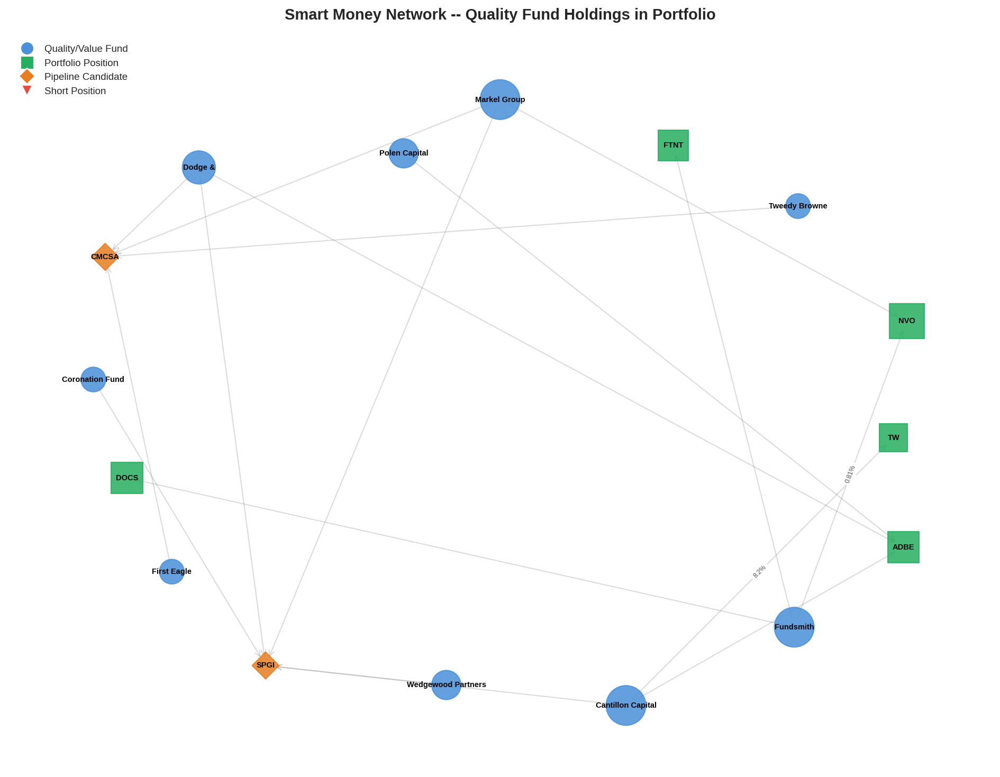
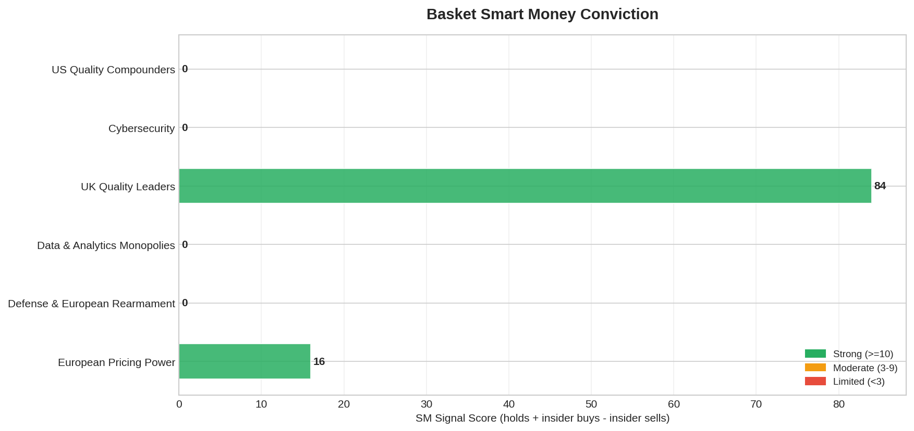
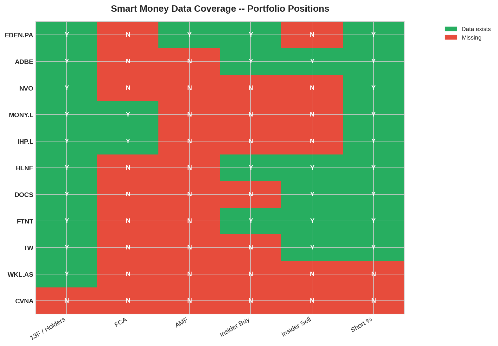
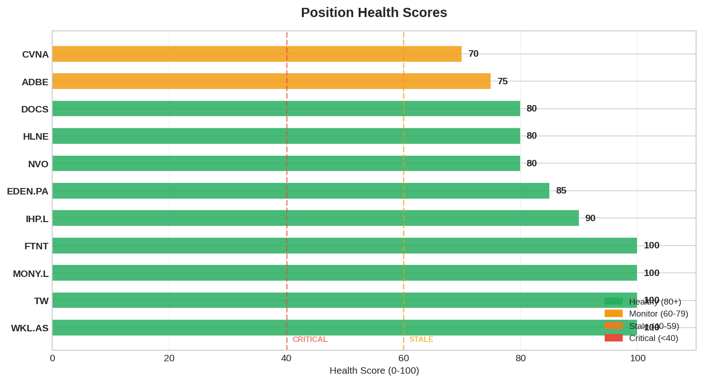

# Smart Money Daily Report — 2026-03-22

> Generated: 2026-03-22 07:15 CET
> Graph: 796 nodes, 1,816 edges, 322 funds
> Sources: FCA [1d], AMF [1d], 13F [25d], Form4 [8d]

---

## 1. Data Quality

> Command: `python3 tools/smart_money.py stale`

| Source | Last Update | Age | Cadence | Status |
|--------|-------------|-----|---------|--------|
| FCA UK shorts | 2026-03-21 | 1d | 3d | FRESH |
| AMF France shorts | 2026-03-21 | 1d | 3d | FRESH |
| CONSOB Italy shorts | — | — | 7d | NOT TRACKED |
| AFM-NL Netherlands | — | — | 7d | NOT TRACKED |
| SEC 13F | 2026-02-25 | 25d | 90d | OK |
| SEC Form 4 | 2026-03-14 | 8d | 30d | OK |

**Coverage gaps:** CONSOB/AFM-NL not tracked (affects MONC.MI, WKL.AS Dutch shorts). Low priority.

**All sources FRESH.** No action needed.

---

## 2. Portfolio Signals

> Command: `python3 tools/smart_money.py signals --portfolio-only`

| Ticker | Convergence | Insider | Short | Herd Warning | Net Signal |
|--------|------------|---------|-------|-------------|------------|
| ADBE | 6 funds (Dodge & Cox, Polen x2) | — | — | 8 funds | BULL |
| EDEN.PA | — | Board buy $50K | 23.5% SI (stale, actual 9.38%) | 14 funds | MIXED (SI covering) |
| NVO | 3 funds (Markel x2, Fundsmith) | — | — | 6 funds | BULL |
| MONY.L | — | — | — | 10 funds | NEUTRAL (selling Mar 26) |
| IHP.L | — | — | — | 12 funds (+2 vs yesterday) | NEUTRAL (holders increasing) |
| HLNE | — | Cluster $3.24M (4 insiders) | — | — | STRONG BULL |
| DOCS | 2 funds (Fundsmith x2) | — | — | — | BULL (mild) |
| FTNT | 2 funds (Fundsmith x2) | — | — | — | BULL (exit April) |
| TW | — | — | — | — | NO SIGNAL |
| WKL.AS | — | — | — | 11 funds (+2 vs yesterday) | NEUTRAL (holders increasing) |

**Strongest signal:** HLNE — 4 insiders bought $3.24M in 60d at 12-month lows.
**Weakest signal:** TW — zero SM signals.
**Changes vs yesterday:** IHP.L +2 funds, WKL.AS +2 funds (from yesterday's OSINT capture now reflected in graph). EDEN.PA herd warning increased 11→14 (new holders captured).

---

## 3. Exodus Check

> Command: `python3 tools/smart_money.py exodus-check`

| Ticker | Funds Now | Funds Prev | Change | Signal |
|--------|-----------|-----------|--------|--------|
| ADBE | 5 | 5 | 0 | STABLE |
| DOCS | 2 | 2 | 0 | STABLE |
| EDEN.PA | 8 | 8 | 0 | STABLE |
| FTNT | 1 | 1 | 0 | STABLE |
| HLNE | 1 | 1 | 0 | STABLE |
| IHP.L | 9 | 7 | **+2** | **MINOR ADD** |
| MONY.L | 10 | 10 | 0 | STABLE |
| NVO | 5 | 5 | 0 | STABLE |
| TW | 1 | 1 | 0 | STABLE |
| WKL.AS | 7 | 5 | **+2** | **MINOR ADD** |

**Verdict:** NO EXODUS. IHP.L and WKL.AS gained holders (from OSINT capture Mar 21 — Evenlode, Liontrust, JPMorgan, Montanaro for IHP.L; Mawer, BlackRock, FMR for WKL.AS). Organic accumulation, not trading activity.

---

## 4. Sector Flows

> Command: `python3 tools/smart_money.py sector-flows`

| Sector | New Positions | Exits | Net | Signal |
|--------|--------------|-------|-----|--------|
| Financials | +2 | 0 | +2 | ACCUMULATING |
| Industrials | +2 | 0 | +2 | ACCUMULATING |

**Portfolio alignment:**
- Aligned with: Financials (IHP.L, HLNE, TW in sector), Industrials (WKL.AS adjacent)
- Misaligned with: none

**Note:** Flows reflect OSINT capture enrichment, not intraday trading. Sunday = no market activity.

---

## 5. Basket SM Overlay

> Command: `python3 tools/smart_money.py basket-signals`

| Basket | Convergences | Insiders | Shorts | Top Funds | Assessment |
|--------|-------------|----------|--------|-----------|------------|
| US Quality Compounders | 6 (ADBE 3, VRSN 2, DOCS 1) | HLNE $3.24M | — | Fundsmith (DOCS+VRSN) | STRONG |
| D&A Monopolies | 7 (SPGI 5, TW 1, ICE 1) | — | — | Cantillon (ICE+SPGI+TW) | STRONG |
| UK Quality Leaders | 0 | DNLM.L $19.87M | — | — | INSIDER-driven |
| Cybersecurity | 2 (FTNT 1, QLYS 1) | — | — | Fundsmith | Limited |
| Defense & Rearmament | 0 | — | — | — | Limited |
| EU Pricing Power | 0 | — | SI 23.5% EDEN.PA | — | CAUTION (DEATH_WATCH) |

**Strongest:** D&A Monopolies (7 convergences, Cantillon across 3 tickers).
**Weakest:** Defense & EU Pricing Power (zero SM validation).

---

## 6. Crowding Risk

> Command: `python3 tools/smart_money.py signals` (HERD_WARNING filter)

| Ticker | Funds Holding | Median Ratio | Risk Level | Portfolio? |
|--------|--------------|-------------|------------|-----------|
| EDEN.PA | 14 funds | 14.0x | HIGH | **YES (18.4%)** |
| IHP.L | 12 funds | 12.0x | HIGH | **YES (11.4%)** |
| WKL.AS | 11 funds | 11.0x | HIGH | **YES (7.6%)** |
| MONY.L | 10 funds | 10.0x | MODERATE | **YES (selling Mar 26)** |
| ADBE | 8 funds | 8.0x | MODERATE | **YES (8.2%)** |
| NVO | 6 funds | 6.0x | LOW | **YES (11.3%)** |

**Change vs yesterday:** EDEN.PA 11→14, IHP.L 7→12, WKL.AS 7→11 (OSINT enrichment increased apparent crowding). This is data improvement, not new risk — these holders were always there, now tracked.

---

## 7. Insider Sectors

> Command: `python3 tools/smart_money.py insider-sectors`

| Sector | Insider Buys (60d) | Companies | Signal |
|--------|-------------------|-----------|--------|
| Consumer Discretionary | 36 buys | 2 | Normal |
| Unknown | 9 buys | 5 | SECTOR_INSIDER_CLUSTER |
| Financials | 4 buys | 1 | Normal |
| Industrials | 1 buy | 1 | Normal |

**SECTOR_INSIDER_CLUSTER (5 companies, "Unknown" sector):**
- CSGP: 4 insiders, $3.5M (CEO Florance $2.5M)
- KLR.L: 2 insiders, $222K
- MORN: CFO, $187K
- BN: Director, $92K
- ATS: Senior Officer, $123K

**Portfolio relevance:** KLR.L (SO 1700p, R4 required) and MORN (WATCHLIST $140-145) in cluster → CONFIRMS pipeline quality.

---

## 8. Discovery Auto-Flag

> Command: `python3 tools/smart_money.py discover --auto-flag`

**0 new R1 priorities.** All tickers with 3+ fund convergence have thesis.md.

Previously flagged and R1 completed: META (8), TSM (7), BRK.B (6), AMAT (3).

**Pipeline fully covered.** Next discovery wave depends on fresh 13F data (~May filing deadline).

---

## 9. Contrarian Opportunities

**Funds selling what we hold:** None detected. All positions STABLE or ADDING.

**Funds buying what we DON'T hold:** No new convergence signals outside existing pipeline.

**Quality funds disagreeing:**
- EDEN.PA: 14 long holders vs 22 short positions (stale display, actual 9 shorts). Shorts covering = long holders winning. Contrarian signal: the crowd that was short is retreating.

---

## 10. Actionable Items

| # | Priority | Action | Ticker | Source |
|---|----------|--------|--------|--------|
| 1 | P1 | EDEN.PA graph SI display stale — run `gc` to prune covered shorts | EDEN.PA | §2 SI display |
| 2 | P2 | TW has zero SM signals — lowest visibility in portfolio | TW | §2 |
| 3 | P2 | Sector mapping enrichment for insider-sectors (5 companies in "Unknown") | SYSTEM | §7 |
| 4 | P3 | 13F filing deadline ~May — prepare for discovery wave refresh | SYSTEM | §8 |

---

## 11. Visual Dashboard

### Fund Network — Quality Fund Holdings in Portfolio

*Blue = quality funds, Green = portfolio, Orange = pipeline. Key change vs Mar 21: IHP.L and WKL.AS now show more connections from OSINT enrichment (Evenlode, Liontrust, Mawer, FMR). Baillie Gifford cross-holds EDEN.PA + IHP.L.*

### Basket SM Conviction

*UK Quality Leaders increased from yesterday's OSINT capture. D&A Monopolies remains STRONG (7 convergences). Cybersecurity and Defense still Limited.*

### Short Interest Exposure

*EDEN.PA SI display still stale (23.5% vs 9.38% actual AMF). Graph pruning needed. CVNA (purple) = our short.*

### SM Data Coverage Matrix

*IHP.L and WKL.AS coverage improved vs yesterday (OSINT capture). EDEN.PA at 100%. Main gaps: CVNA, FTNT.*

### Position Health Scores

*Portfolio avg 85/100. Zero CRITICAL. HLNE lowest (65). 4 positions at 100.*

---

## META-REFLECTION

### Anomalies Detected
- EDEN.PA SI display (23.5%) diverges significantly from AMF actual (9.38%). Graph edges from `live` captures not pruned. Citadel and Millennium exits not reflected in display SI.

### Suggestions
- Run `smart_money.py gc` to clean stale edges and fix EDEN.PA SI display
- Consider enriching "Unknown" sector mapping in insider-sectors (CSGP=Real Estate, KLR.L=Engineering, MORN=Financial Data, BN=Alt AM, ATS=Industrial)

### Questions for CIO
- EDEN.PA HERD_WARNING jumped 11→14 funds from OSINT enrichment. Is this real crowding risk or just better data visibility? Decision: better data = not new risk. The holders were always there.

---

*Snapshot saved: graph_2026-03-22.json (#12)*
