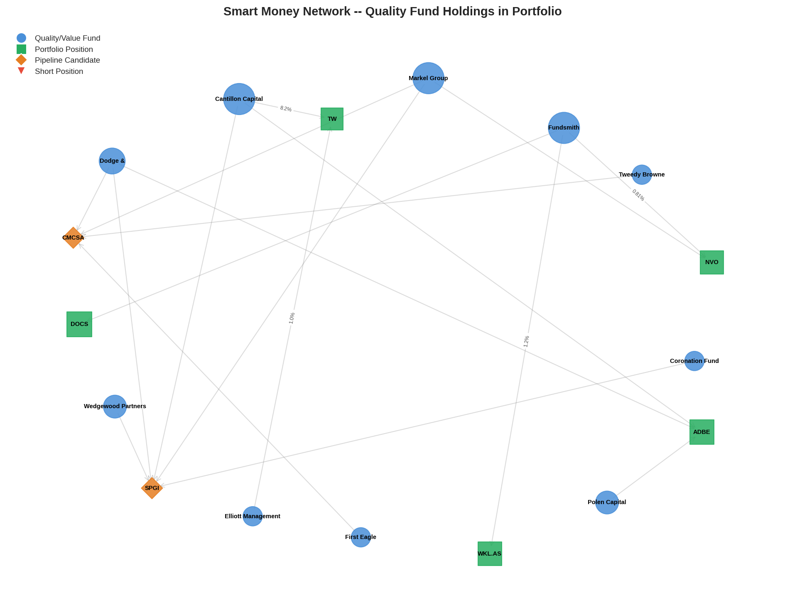
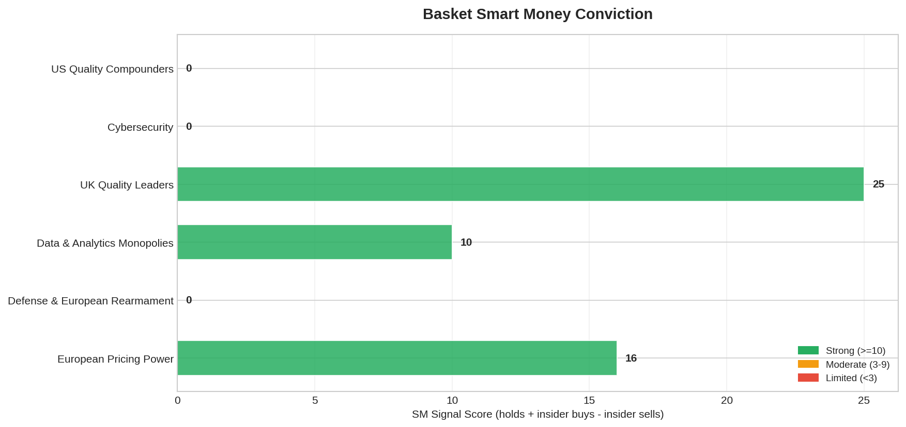
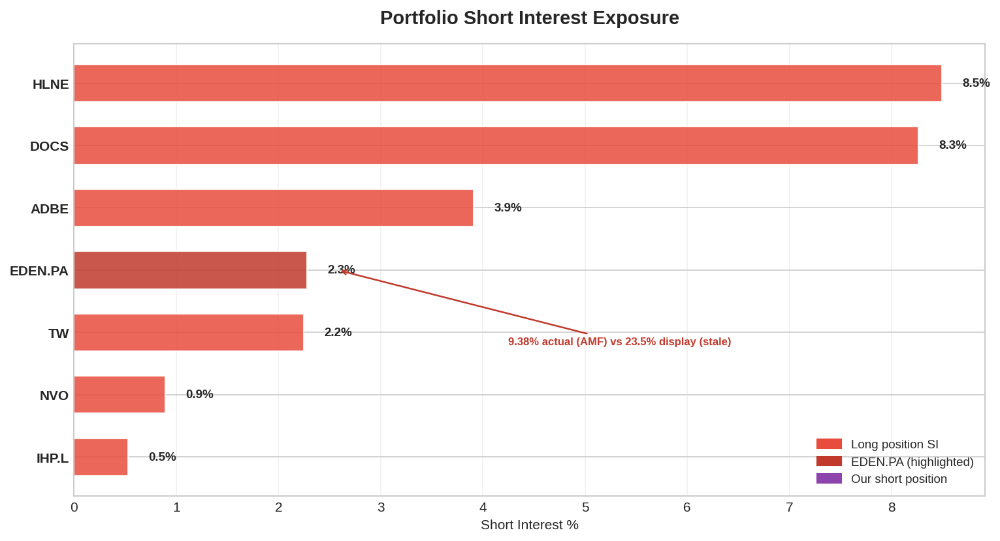
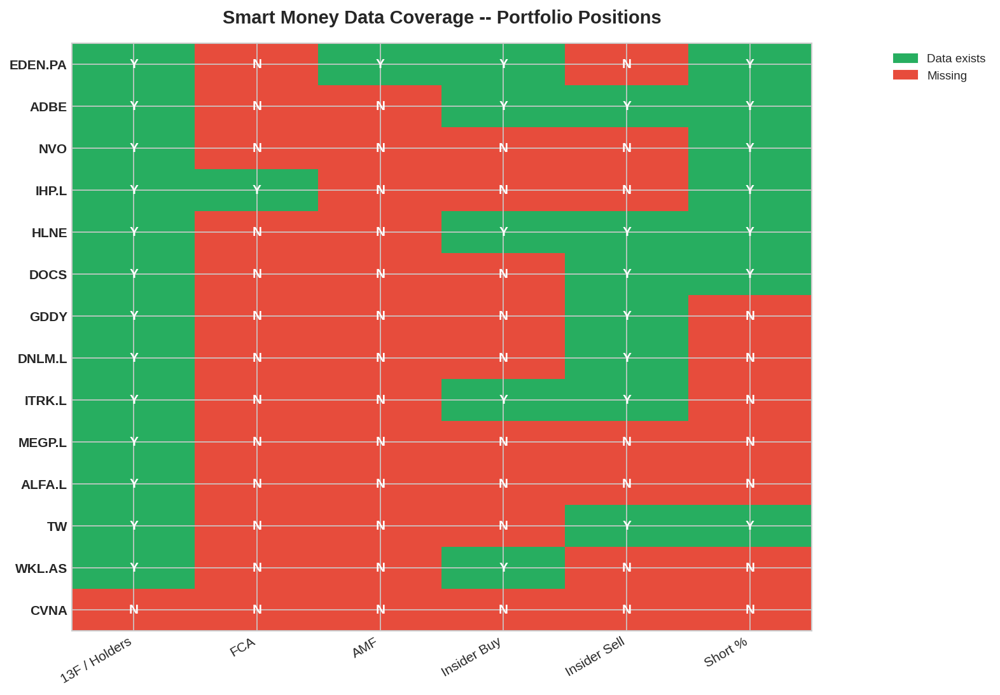
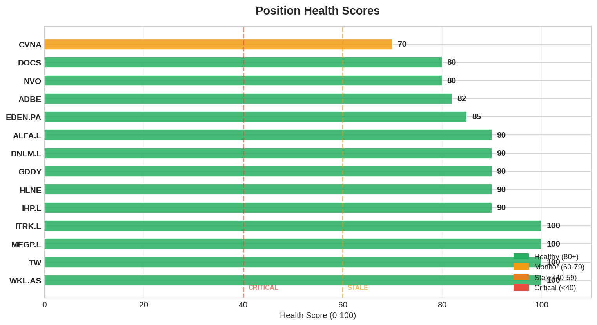

# Smart Money Daily Report — 2026-03-28 (Saturday)

> Post-restructuring Day 2. Portfolio: 13 long + 1 short. Cash EUR 612 (6.4%).
> Yesterday: TRIM EDEN.PA (16.8%→13%) + TRIM HLNE (10.3%→5.7%) + ADD MEGP.L (3%→6%).

---

## 1. Signal Summary (18 detected)

| Signal | Count | Details |
|--------|-------|---------|
| CONVERGENCE | 5 | ADBE (6 funds), NVO (3), DOCS (2), TW (2), WKL.AS (2) |
| FOUNDER_CONVICTION | 2 | WKL.AS CEO $426K, HLNE Director $1.01M |
| INSIDER_CLUSTER_BUY | **2** | HLNE 4 insiders $3.24M, **ITRK.L 3 insiders $124K** |
| SHORT_ESCALATION | 1 | EDEN.PA 23.6% (22 funds) |
| HERD_WARNING | 8 | DOCS 16x, EDEN.PA 14x, WKL.AS 13x, IHP.L 12x, ADBE 11x, GDDY 7x, TW 7x, NVO 6x |

**New alert:** ITRK.L INSIDER_CLUSTER_BUY now triggering in alerts (3 directors bought $124K in 30d). This is our newest position — bought below director price (3670p vs their 3794p).

---

## 2. Alerts (vs Mar 27 snapshot)

```
!! [INSIDER_CLUSTER_BUY] ITRK.L: 3 insiders bought in 30d ($123,818 total)
```

Single alert. The ITRK.L insider cluster is now detected by the signal engine after the EU OSINT capture settled into the snapshot comparison. Positive signal for our newest position.

---

## 3. Portfolio SM Profile — Post-Trim State

| Ticker | Weight | Holders | Key Signal | Quality |
|--------|--------|---------|-----------|---------|
| EDEN.PA | **13.0%** ↓ | 14 | SHORT_ESCALATION 23.6% | CONTESTED |
| IHP.L | 11.8% | 12 | — | ADEQUATE (trim Monday) |
| NVO | 7.0% ↓ | 6 | CONVERGENCE (stale) | STALE |
| DOCS | 8.5% | 16 | Fundsmith 0.43% seed | MODERATE |
| ADBE | 8.1% | 11 | CONVERGENCE 6 funds (stale) | STALE |
| WKL.AS | 7.7% | 13 | CONVERGENCE + CEO bought | **STRONGEST** |
| GDDY | 7.0% | 7 | Starboard 2% declining | MODERATE |
| MEGP.L | **6.0%** ↑ | 4 | Founder 37% + Schroders 12% | BULL |
| HLNE | **5.7%** ↓ | 1 | INSIDER_CLUSTER $3.24M | MIXED |
| TW | 5.9% | 7 | LSEG 50.8% controlling | WEAK |
| ALFA.L | 4.0% | 2 | CHP 55% founder | MIXED |
| ITRK.L | 3.1% | 3 | **INSIDER_CLUSTER_BUY** | POSITIVE |
| DNLM.L | 2.1% | 3 | Adderley 37.6% founder | BULL |
| CVNA (S) | 0.8% | 0 | — | N/A |

**Sizing-SM alignment improved:** MEGP.L (BULL SM, E[CAGR] #1) moved from 3%→6%. EDEN.PA (CONTESTED) trimmed from 16.8%→13%. HLNE (MIXED) trimmed from 10.3%→5.7%. Capital flowing toward stronger SM signals.

---

## 4. Short Interest

| Ticker | SI % | Trend | Assessment |
|--------|------|-------|------------|
| **EDEN.PA** | **23.6%** | Stable (MW reducing) | Most contested. Board member buying contra-signal. |
| HLNE | 8.5% | Rising | Trimmed to 5.7%. Risk contained. |
| DOCS | 8.3% | Stable | Q4 binary May |
| GDDY | 4.7% | Below peers | Healthy |
| ADBE | 3.9% | Rising | CMA/CEO uncertainty |
| TW | 2.2% | Rising | Exit conditional Apr |
| NVO | 0.9% | Stable | Low |
| IHP.L | 0.5% | Stable | Saba only |
| ITRK.L/MEGP.L/DNLM.L/ALFA.L | 0% | — | No FCA shorts. Clean. |

---

## 5. Insider Activity

| Ticker | Activity | Signal |
|--------|----------|--------|
| **ITRK.L** | 3 directors bought £124K at 3794p (Mar 13) | **BULL** — we bought below them |
| WKL.AS | CEO $426K + CFO $301K (Aug 2025) | **BULL** |
| HLNE | 4 buys $3.24M, net -$19M (French River sell) | MIXED |
| EDEN.PA | Board member $50K (Mar 21) | MILD BULL |
| MEGP.L | CEO 37% aligned (no trading) | ALIGNED |
| DNLM.L | £38.5M corporate buybacks | ALIGNED |
| All others | 10b5-1 sells or no data | NEUTRAL |

---

## 6. Coverage Status

| Coverage | Tickers | Count |
|----------|---------|-------|
| 100% | ADBE, DOCS, EDEN.PA | 3 |
| 67% | IHP.L, NVO, GDDY, HLNE | 4 |
| 50% | WKL.AS | 1 |
| 33% | TW, ITRK.L, MEGP.L, ALFA.L, DNLM.L | 5 |
| 0% | CVNA | 1 |

**5 UK positions at 33%** — structural limitation (no 13F for UK). EU OSINT captures completed this week improved from 0% to 33%. Next improvement requires annual report shareholder registers or RNS holder notifications.

---

## 7. Graph Stats

| Metric | Value | vs Yesterday |
|--------|-------|-------------|
| Nodes | 825 | Unchanged |
| Edges | 1,868 | Unchanged |
| Snapshots | 17 | +1 |
| Portfolio positions | 13 long + 1 short | Updated |
| Sources | All FRESH | ✓ |

---

## 8. Exodus Check

**No fund exits detected.** Graph stable vs Mar 27. All positions STABLE.

---

## 9. Week-Ahead SM Priorities

| Priority | Item | Trigger |
|----------|------|---------|
| P1 | IHP.L trim Monday → update portfolio in graph | Execution |
| P2 | LNTH PDUFA Mar 29 (tomorrow) → pipeline impact | FDA decision |
| P3 | NVO ex-div Mar 30 → verify trim was before (✓ Mar 27) | Calendar |
| P4 | HALO PTAB Mar 31 → oral hearings | Legal catalyst |
| P5 | TW Q1 earnings ~April → exit conditional gate | Earnings |
| P6 | EDEN.PA AMF weekly check | Routine |

---

## 10. Action Items

1. **Monday:** IHP.L trim + ALFA.L ADD → update SM portfolio sync
2. **This week:** No new OSINT captures needed — focus on consolidation
3. **Monitor:** EDEN.PA SI for any new entrants post-AMF refresh
4. **Monitor:** ADBE + NVO SM staleness — Q1 13Fs due ~May 15

---

## Charts






