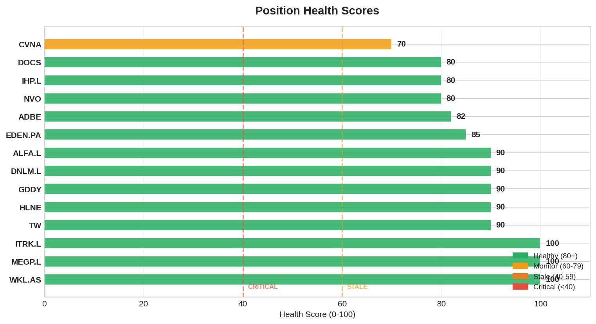

# Smart Money Daily Report — 2026-03-30 (Monday)

> Post-IHP.L trim + ALFA.L ADD. NVO ex-div today. All sizing rebalances COMPLETE.
> Portfolio: 13 long + 1 short. Cash EUR 614 (6.4%).

---

## 1. Signal Summary (18 detected — unchanged)

| Signal | Count | Details |
|--------|-------|---------|
| CONVERGENCE | 5 | ADBE (6), NVO (3), DOCS (2), TW (2), WKL.AS (2) |
| FOUNDER_CONVICTION | 2 | WKL.AS CEO $426K, HLNE Director $1.01M |
| INSIDER_CLUSTER_BUY | 2 | HLNE $3.24M, ITRK.L $124K |
| SHORT_ESCALATION | 1 | EDEN.PA 23.6% (22 funds) |
| HERD_WARNING | 8 | DOCS 16x, EDEN.PA 14x, WKL.AS 13x, IHP.L 12x, ADBE 11x, GDDY 7x, TW 7x, NVO 6x |

Signals unchanged vs Saturday. Stable graph.

---

## 2. Alerts

```
!! [INSIDER_CLUSTER_BUY] ITRK.L: 3 insiders bought in 30d ($123,818 total)
```

Persistent alert — ITRK.L directors bought at 3794p, our entry 3670p. We're below their price.

---

## 3. Standing Order Watch — BCG.L + CMCSA

### BCG.L: **TRIGGERED** (2nd day)

| Metric | Value |
|--------|-------|
| SO Trigger | 175p |
| Price | **169.4p** (-3.2% below trigger) |
| 52wL | 168.0p (price 0.8% above floor) |
| FV | ~260p |
| E[CAGR] | ~18% at 169p |
| R4 Status | BUY APPROVED |
| Capital needed | EUR 300 |

**Decision: DEFER.** Rationale from Saturday:
1. Consolidation > expansion (just executed 13 trades in 5 days)
2. Cash EUR 614 is earnings season buffer (May gauntlet)
3. 14th long position stretches EUR 10K portfolio
4. If CMCSA also triggers → capital allocation conflict
5. BCG.L SO remains ACTIVE — monitor daily

### CMCSA: **Near trigger** (1.2% away)

| Metric | Value |
|--------|-------|
| SO Trigger | $28.00 |
| Price | **$28.33** (+1.2% above trigger) |
| 52wL | $24.13 |
| FV | $34 |
| E[CAGR] | ~14.2% at $28 |
| R4 Status | BUY APPROVED |
| Capital needed | EUR 300 |

**Decision: MONITOR.** One bad session could trigger. If CMCSA triggers before BCG.L capital decision → CMCSA gets priority (US diversification, larger cap, R4 approved).

### SPGI: Approaching

| Metric | Value |
|--------|-------|
| SO Trigger | $380 |
| Price | **$406.24** (+6.9% above) |
| Status | Approaching but not imminent |

---

## 4. NVO Ex-Dividend Today

NVO goes ex-dividend today (DKK 5.30/share, ~$0.71). Our trim was executed Mar 27 (3 days before ex-div). 28.53 shares will receive the dividend. Expected: ~$20 (EUR ~17). Small but captured.

---

## 5. Portfolio SM Profile — Post-Final-Trim

| Ticker | Weight | SM Quality | Change |
|--------|--------|-----------|--------|
| EDEN.PA | 13.0% | CONTESTED | Trimmed from 16.8% |
| IHP.L | **8.3%** | ADEQUATE | **Trimmed today from 11.8%** |
| NVO | 7.0% | STALE | Trimmed from 11.7% |
| DOCS | 8.5% | MODERATE | — |
| ADBE | 8.1% | STALE | — |
| WKL.AS | 7.7% | **STRONGEST** | — |
| GDDY | 7.0% | MODERATE | New |
| HLNE | 5.7% | MIXED | Trimmed from 10.3% |
| **ALFA.L** | **6.5%** | MIXED | **ADD today from 4.0%** |
| MEGP.L | 6.0% | BULL | ADD from 3.0% |
| TW | 5.9% | WEAK | Exit conditional Apr |
| ITRK.L | 3.1% | POSITIVE | Starter |
| DNLM.L | 2.1% | BULL | Starter |
| CVNA (S) | 0.8% | N/A | — |

**All oversized positions trimmed. All path dependencies broken:**
- EDEN.PA: 18.7% → 13.0% ✓
- IHP.L: 11.8% → 8.3% ✓
- HLNE: 10.3% → 5.7% ✓
- NVO: 11.7% → 7.0% ✓

**Capital rotated to underweight quality:**
- MEGP.L: 3% → 6% (E[CAGR] #1) ✓
- ALFA.L: 4% → 6.5% (ROE 58.6%, near 52wL) ✓

---

## 6. Short Interest

| Ticker | SI % | Change vs Sat |
|--------|------|---------------|
| EDEN.PA | 23.6% | Unchanged |
| HLNE | 8.5% | Unchanged |
| DOCS | 8.3% | Unchanged |
| GDDY | 4.7% | Unchanged |
| ADBE | 3.9% | Unchanged |
| TW | 2.2% | Unchanged |
| All UK positions | 0% | Clean |

---

## 7. Exodus Check

**No exits detected.** Graph stable vs Saturday. All positions STABLE.

---

## 8. Graph Stats

| Metric | Value |
|--------|-------|
| Nodes | 825 |
| Edges | 1,868 |
| Snapshots | 18 (daily cadence) |
| Portfolio positions | 13 long + 1 short |
| All sources | FRESH |

---

## 9. Week Ahead

| Date | Event | Action |
|------|-------|--------|
| **Today Mar 30** | NVO ex-div | Captured ✓ |
| **Mar 31** | HALO PTAB oral hearings | Pipeline catalyst. SO paused $55. |
| **Mar 31** | HLNE + DOCS fiscal year end | Q4 starts tomorrow. |
| **Apr 5** | TSLA Q1 deliveries | Short decision gate: <370K = enter $270-310 |
| **~Apr 15** | DSY.PA Q1 | SO review: cancel if growth <3% |
| **~Apr 21** | IHP.L Q2 trading update | Key for position sizing |
| **~Apr 23** | CMCSA Q1 earnings | R4 approved, SO $28 near trigger |
| **Apr 25** | CVNA earnings prep | Framework ready (S155) |
| **~May 6** | NVO + CVNA Q1 | Binary for both positions |

---

## 10. Action Items

1. **BCG.L**: TRIGGERED but DEFERRED. Monitor daily. Revisit after CMCSA clarity.
2. **CMCSA**: 1.2% from trigger. If fills → priority over BCG.L. Monitor daily.
3. **HALO PTAB tomorrow**: oral hearings. If positive signals → reconsider SO.
4. **No new trades this week** unless CMCSA triggers. Consolidation mode.
5. **Earnings prep**: CVNA framework done. DOCS/HLNE/NVO frameworks done. Ready for May.

---

## Charts



