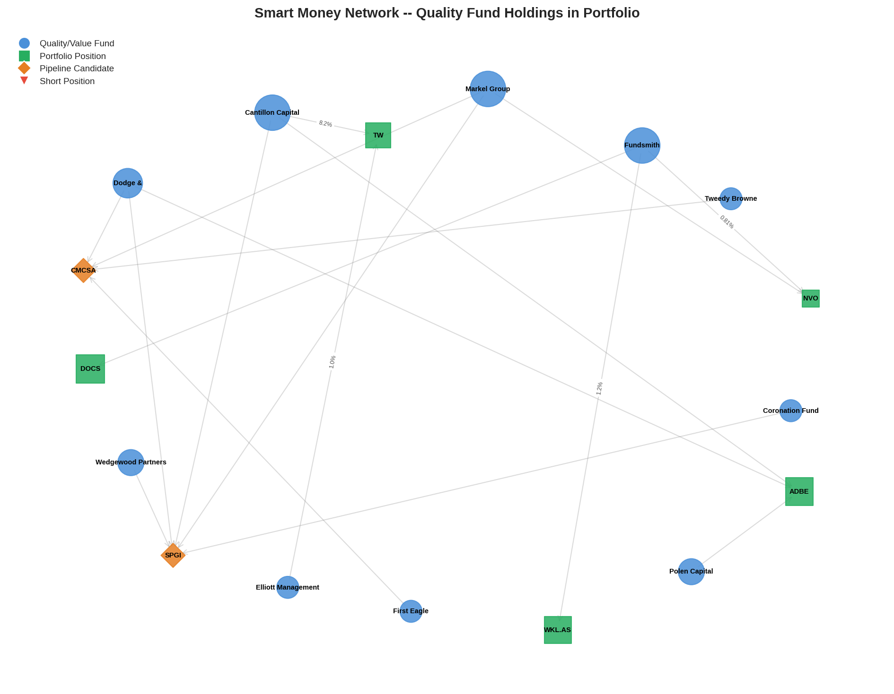
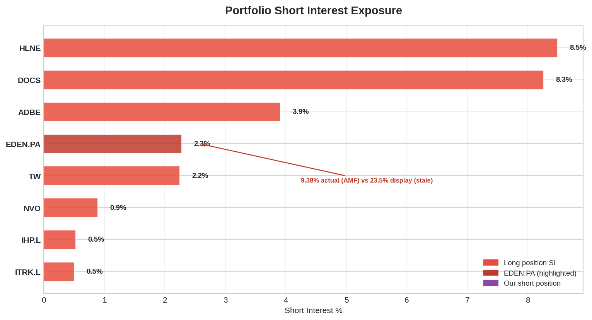
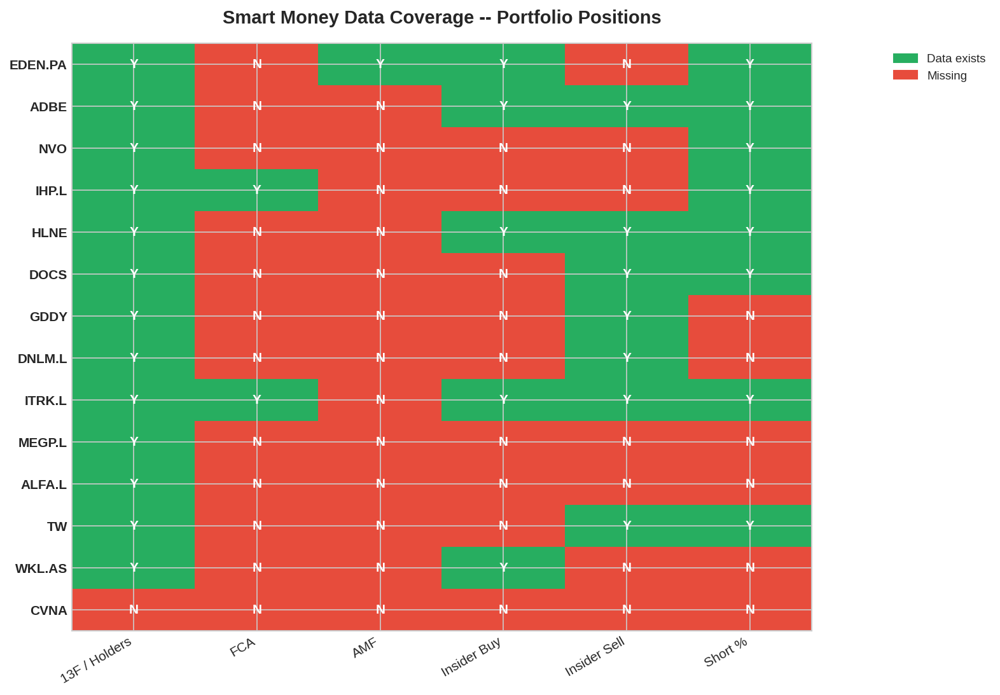
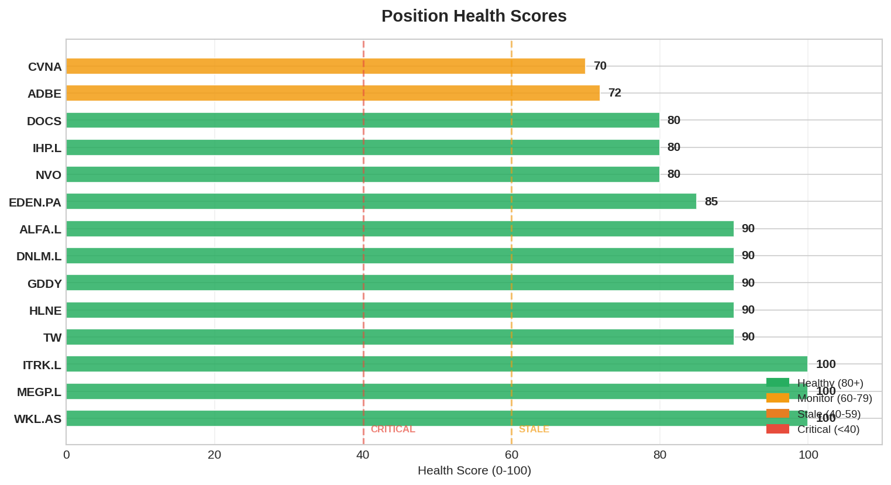

# Smart Money Daily Report — 2026-04-06 (Sunday)

> 7 days since last SM report. FCA/AMF refreshed (were VERY_STALE 10 days).
> Portfolio: 13 long + 1 short. Cash EUR 614 (6.4%). NVO EXIT pending execution.
> **Orforglipron FDA: 4 days (Apr 10). DOCS + HLNE at new 52wL.**

---

## 1. Signal Summary (18 — unchanged count, updated data)

| Signal | Count | Details |
|--------|-------|---------|
| CONVERGENCE | 5 | ADBE (6), NVO (3), DOCS (2), TW (2), WKL.AS (2) |
| FOUNDER_CONVICTION | 2 | WKL.AS CEO $426K, HLNE Director $1.01M |
| INSIDER_CLUSTER_BUY | 2 | HLNE $3.24M, ITRK.L $124K |
| SHORT_ESCALATION | 1 | **EDEN.PA 23.6% (22 funds) — AMF INCREASED this week** |
| HERD_WARNING | 8 | DOCS 16x, EDEN.PA 14x, WKL.AS 13x, IHP.L 12x, ADBE 11x, GDDY 7x, TW 7x, NVO 6x |

---

## 2. CRITICAL: EDEN.PA Short Interest INCREASING

**AMF refresh reveals 5 of 9 funds ADDED to EDEN.PA shorts in the last 10 days:**

| Fund | Mar 27 | Apr 6 | Change | Direction |
|------|--------|-------|--------|-----------|
| Two Sigma | 1.31% | **1.43%** | +0.12pp | **ADDING** |
| Marshall Wace | 1.19% | **1.30%** | +0.11pp | **REVERSED — was reducing, now adding** |
| D.E. Shaw | 1.01% | **1.08%** | +0.07pp | **ADDING** |
| Gladstone | 0.60% | **0.74%** | +0.14pp | **ADDING** |
| Voleon | 0.60% | **0.74%** | +0.14pp | **ADDING** |
| CPPIB | 2.28% | 2.28% | — | Unchanged (largest) |
| Samlyn | 0.90% | 0.90% | — | Unchanged |
| AQR | 0.89% | 0.89% | — | Unchanged |
| SurgoCap | 0.66% | 0.66% | — | Unchanged |
| **AMF Total** | **9.44%** | **10.02%** | **+0.58pp** | **ESCALATING** |

**Marshall Wace reversal is the most concerning signal.** Previously our narrative was "MW reducing = bears covering." They've REVERSED to adding. Combined with 4 other funds increasing, this is a coordinated ESCALATION, not covering.

**Impact on EDEN.PA thesis:** FV EUR 20.5 (S155b revision) already incorporated 5 regulatory fronts. The short escalation is CONSISTENT with the market pricing broader regulatory damage. At EUR 17.12 with rising SI, the market-neutral view says shorts see MORE downside. Board member Richdale bought $50K Mar 21 = lone contra-signal.

---

## 3. Exodus Check — CLEAN

**Zero fund exits across all 13 positions.** All STABLE vs Mar 31 snapshot. Graph unchanged in holder structure. The 7-day gap produced no detectable institutional repositioning in our holdings.

---

## 4. Positions at 52-Week Lows

### DOCS — New 52wL $21.82

| Metric | Value |
|--------|-------|
| Price | $22.77 (52wL $21.82 hit this week) |
| Cost | $24.41 |
| P&L | **-6.7%** |
| SM Profile | Fundsmith 0.43% (seed), Fidelity +37.6% Q4, Capital World adding |
| Q4 Earnings | ~May 15 (binary — NRR is the question) |
| KC#8 | NRR <110% early warning — APPROACHING (was 112%, decelerating -3pp/Q) |

**No SM-driven explanation for the decline.** No fund exits detected. The drop appears to be anticipatory selling ahead of Q4 earnings (MFN fear + NRR deceleration narrative). Fundsmith at 0.43% provides no floor.

### HLNE — New 52wL $90.47

| Metric | Value |
|--------|-------|
| Price | $94.19 (52wL $90.47 hit this week) |
| Cost | $94.77 |
| P&L | **-0.6%** |
| SM Profile | 1 tracked holder. INSIDER_CLUSTER_BUY $3.24M (but net -$19M) |
| Q4 Earnings | ~late May (binary — Evergreen flows) |
| Blue Owl | Crisis continuing. OBDC II gated, BlackRock HPS restricted. |

**HLNE decline tracks Blue Owl sentiment contagion.** Not company-specific fundamentals — PE fundraising Q1 was record $80B+. The market doesn't distinguish "Evergreen PE" from "Evergreen credit" when Blue Owl headlines dominate.

---

## 5. NVO Pre-Exit SM Context

NVO EXIT decided Mar 31, pending eToro execution. SM context for the exit:

| Signal | Status |
|--------|--------|
| Markel Group | HOLDS (Q4 2025 13F, stale) |
| Fundsmith | HOLDS at ~0.8% of portfolio (stale) |
| Insider buys | ZERO open-market purchases at any point |
| SI | 0.9% (low — shorts not positioned) |

**SM does NOT block the exit.** Fund data is stale (Q4 2025, pre-CagriSema failure, pre-guidance disaster). Real institutional conviction is unknown until Q1 2026 13Fs (~May 15). Orforglipron FDA Apr 10 is the immediate catalyst — exit before.

---

## 6. Orforglipron FDA Watch (Apr 10 — 4 days)

| Item | Status |
|------|--------|
| FDA action date | **April 10, 2026** |
| Lancet head-to-head | Orforglipron OUTPERFORMED oral semaglutide |
| Lilly pre-launch | Building inventory (expects approval) |
| Approval probability | ~70% |
| NVO impact if approved | Bear probability 25%→40%, FV $47→$42-43 |
| Our action | EXIT NVO before Apr 10. Re-entry post-event if thesis justifies. |

**MANDATORY: Execute NVO exit Monday/Tuesday (Apr 7-8).** Cannot be delayed further.

---

## 7. Data Freshness

| Source | Last Update | Status |
|--------|-------------|--------|
| FCA UK Shorts | **2026-04-06** | **FRESH** (refreshed this session) |
| AMF France Shorts | **2026-04-06** | **FRESH** (refreshed this session) |
| SEC 13F | 2026-02-25 (Q4 2025) | ACCEPTABLE (next: Q1 ~May 15) |
| SEC Form 4 | 2026-03-14 | STALE (23d, cadence 30d) |

Form 4 approaching staleness — refresh next session.

---

## 8. Graph Stats

| Metric | Mar 31 | Apr 6 | Delta |
|--------|--------|-------|-------|
| Nodes | 825 | 825 | 0 |
| Edges | 1,868 | 1,874 | +6 (AMF short updates) |
| Shorts | 195 | 201 | +6 |
| Snapshots | 19 | 20 | +1 |

---

## 9. Portfolio SM Profile Summary

| Ticker | Weight | SM Quality | 52wL? | Key Signal |
|--------|--------|-----------|-------|-----------|
| EDEN.PA | 13.0% | **DETERIORATING** | Near | **Shorts ESCALATING +0.58pp. MW reversed.** |
| IHP.L | 8.3% | ADEQUATE | No | Stable |
| ADBE | 8.6% | STALE | Near | All pre-event Q4 2025 |
| DOCS | 8.4% | MODERATE | **YES** | New 52wL $21.82. Q4 binary May. |
| WKL.AS | 8.1% | **STRONGEST** | No | CEO bought + Fundsmith starter |
| GDDY | 7.7% | MODERATE | No | Starboard declining |
| NVO | 9.7% | STALE | Near | **EXIT PLANNED pre-Apr 10** |
| HLNE | 6.7% | MIXED | **YES** | New 52wL $90.47. Blue Owl contagion. |
| ALFA.L | 6.8% | MIXED | Near | CHP 55% founder |
| MEGP.L | 6.5% | BULL | No | Founder 37% + Schroders 12% |
| TW | 6.3% | WEAK | No | EXIT CONDITIONAL Apr 29 |
| ITRK.L | 3.2% | POSITIVE | No | INSIDER_CLUSTER_BUY |
| DNLM.L | 2.1% | BULL | No | Bounce from 52wL |
| CVNA (S) | 0.9% | N/A | — | Short position |

---

## 10. Action Items — Priority Order

| # | Action | Urgency | Deadline |
|---|--------|---------|----------|
| **1** | **NVO EXIT — execute in eToro** | **CRITICAL** | **Mon-Tue Apr 7-8** |
| 2 | EDEN.PA: assess if short escalation changes thesis | HIGH | This session |
| 3 | TSLA Q1 deliveries check (was Apr 5) — short decision gate | MEDIUM | Today |
| 4 | Form 4 refresh (23d stale) | LOW | Next session |
| 5 | TW earnings prep (Apr 29) | LOW | By Apr 25 |

---

## Charts

